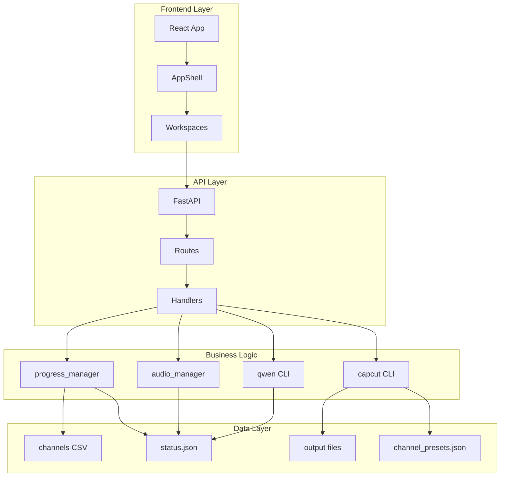

# YouTube Master システム設計書

> **最終更新**: 2025-11-19
> **バージョン**: 1.1
> **参照**: `要件定義書.md`, `ssot/README.md`, `spec/channel_config_spec.md`

---

## 目次

1. [システムアーキテクチャ](#1-システムアーキテクチャ)
2. [コンポーネント設計](#2-コンポーネント設計)
3. [データフロー](#3-データフロー)
4. [技術スタック詳細](#4-技術スタック詳細)
5. [セキュリティ設計](#5-セキュリティ設計)
6. [パフォーマンス設計](#6-パフォーマンス設計)
7. [拡張性設計](#7-拡張性設計)

---

## 1. システムアーキテクチャ

### 1.1 全体アーキテクチャ

```
┌─────────────────────────────────────────────────────────────┐
│                      YouTube Master                          │
│                                                              │
│  ┌──────────────┐         ┌──────────────┐                 │
│  │   Frontend   │────────▶│   Backend    │                 │
│  │   React      │  REST   │   FastAPI    │                 │
│  │   Port 3000  │         │   Port 8000  │                 │
│  └──────────────┘         └──────┬───────┘                 │
│                                   │                          │
│                          ┌────────┴────────┐                │
│                          │                 │                │
│                   ┌──────▼──────┐  ┌──────▼──────┐         │
│                   │  Script     │  │   Video     │         │
│                   │  Pipeline   │  │  Pipeline   │         │
│                   │ (commentary_01)│(commentary_02)│         │
│                   └──────────────┘  └──────────────┘         │
│                          │                 │                │
│                   ┌──────▼─────────────────▼──────┐         │
│                   │      SoT (Single Source)      │         │
│                   │  - progress/channels/CHxx.csv │         │
│                   │  - data/CHxx/<video>/         │         │
│                   │  - output/<project>/          │         │
│                   │  - config/channel_presets.json│         │
│                   └───────────────────────────────┘         │
└─────────────────────────────────────────────────────────────┘
```

### 1.2 レイヤー構成

| レイヤー | 技術 | 責務 |
|---------|------|------|
| **Presentation** | React (TypeScript) | UI表示・ユーザー操作 |
| **API Gateway** | FastAPI (Python) | リクエスト処理・ルーティング |
| **Business Logic** | Python CLI/Scripts | 台本生成・音声合成・動画生成 |
| **Data Access** | File System | SoTファイル読み書き |
| **External Services** | OpenRouter, Gemini, VoiceVox | LLM・画像生成・台本生成・TTS |

### 1.3 主要ディレクトリ構成

```
youtube_master/
├── ui/                          # 統合UIスタック
│   ├── frontend/               # Reactアプリケーション
│   │   ├── src/
│   │   │   ├── pages/          # ページコンポーネント
│   │   │   ├── components/     # 再利用可能コンポーネント
│   │   │   ├── layouts/       # レイアウト（AppShell）
│   │   │   └── api/           # APIクライアント
│   │   └── package.json
│   ├── backend/                # FastAPIアプリケーション
│   │   ├── main.py             # エントリーポイント
│   │   └── requirements.txt
│   └── tools/                  # 起動・管理ツール
│       └── start_manager.py
│
├── commentary_01_srtfile_v2/   # 台本・音声ライン
│   ├── qwen/                   # 台本生成（LLM）
│   ├── core/tools/             # コアツール
│   │   ├── progress_manager.py
│   │   ├── audio_manager.py
│   │   └── planning_store.py
│   └── data/CHxx/<video>/      # 台本・音声SoT
│
├── commentary_02_srt2images_timeline/  # 画像・動画ライン
│   ├── tools/                  # 画像生成・CapCut
│   │   └── capcut_bulk_insert.py # 動画生成コア（channel_presets対応）
│   ├── config/                 # 設定ファイル
│   │   └── channel_presets.json # チャンネル別設定SoT
│   └── output/<project>/       # 動画成果物SoT
│
├── progress/                   # 進捗管理
│   ├── channels/CHxx.csv       # 企画・進捗SoT
│   ├── personas/               # ペルソナ定義
│   └── templates/              # テンプレート
│
├── thumbnails/                 # サムネイル管理
│   ├── assets/<channel>/       # サムネ画像SoT
│   └── projects.json           # メタデータ
│
├── ssot/                       # 仕様・要件定義
│   ├── core/                   # 要件定義
│   ├── ops/                    # 運用仕様
│   └── history/                # 履歴
│
└── logs/                       # ログ
    └── regression/             # 回帰テスト・証跡
```

---

## 2. コンポーネント設計

### 2.1 フロントエンドコンポーネント

#### 2.1.1 AppShell（共通レイアウト）

**責務**:
- サイドバーナビゲーション
- チャンネル・動画選択状態管理
- 共通データフェッチ（channels, videos, dashboard）
- Outletコンテキスト提供

**主要状態**:
```typescript
{
  channels: Channel[];
  videos: Video[];
  selectedChannel: string | null;
  selectedVideo: string | null;
  dashboardOverview: DashboardOverview;
  videoDetail: VideoDetail | null;
}
```

**依存API**:
- `GET /api/channels`
- `GET /api/channels/{code}/videos`
- `GET /api/dashboard/overview`
- `GET /api/channels/{code}/videos/{video}`

#### 2.1.2 主要ワークスペース

| ワークスペース | コンポーネント | 主要機能 |
|--------------|--------------|---------|
| Dashboard | `DashboardPage` | 全体進捗・Pending表示 |
| ScriptFactory | `ProjectsPage` | 企画CSV表示・バッチ投入 |
| Channel Workspace | `ChannelWorkspacePage` | 台本・音声管理 |
| Production | `ProductionPage` | CapCut制作・ジョブ管理 |
| Thumbnails | `ThumbnailsPage` | サムネライブラリ・紐付け |
| Audio Review | `AudioReviewPage` | 音声品質確認 |

#### 2.1.3 VideoDetailPanel（案件詳細）

**責務**:
- 台本・音声・履歴タブ表示
- 編集・保存・検証機能
- 未保存変更検知

**タブ構成**:
- **Script**: 台本編集・AI検証・校正チェック
- **Audio**: 音声プレイヤー・SRT編集・タイムライン
- **History**: 更新履歴・ActivityLog

### 2.2 バックエンドコンポーネント

#### 2.2.1 FastAPIアプリケーション

**エントリーポイント**: `ui/backend/main.py`

**主要ルーター**:
- `/api/channels/*` - チャンネル管理
- `/api/planning/*` - 企画CSV操作
- `/api/video-production/*` - 動画制作
- `/api/prompts/*` - プロンプト管理
- `/api/workspaces/thumbnails/*` - サムネ管理

**依存関係**:
- `commentary_01_srtfile_v2/core/tools/*` - 台本・音声ツール
- `commentary_02_srt2images_timeline/tools/*` - 動画ツール
- `progress/channels/CHxx.csv` - 企画SoT

#### 2.2.2 CLIツール

| ツール | 責務 | 主要コマンド |
|--------|------|------------|
| `progress_manager` | 進捗管理・整合性チェック | `validate-status`, `update-stage`, `set-status` |
| `audio_manager` | 音声合成 | `synthesize` |
| `planning_store` | 企画CSV操作 | `refresh`, `get_rows` |
| `start_manager` | UI起動・管理 | `start`, `stop`, `status`, `healthcheck` |
| `capcut_bulk_insert` | 動画ドラフト生成 | `channel`, `srt-file` |

### 2.3 データパイプライン

#### 2.3.1 台本生成パイプライン

```
企画CSV (progress/channels/CHxx.csv)
    │
    ├─▶ progress_manager init
    │       └─ status.json 初期化
    │
    ├─▶ qwen/run_stage.py --stage research
    │       └─ content/analysis/research/research_brief.md
    │
    ├─▶ qwen/run_stage.py --stage script_outline
    │       └─ content/outline.md
    │
    ├─▶ qwen/run_stage.py --stage script_draft
    │       └─ content/chapters/*.md
    │
    ├─▶ qwen/run_stage.py --stage script_enhancement
    │       └─ content/chapters/*.md (上書き)
    │
    ├─▶ qwen/run_stage.py --stage script_review
    │       └─ content/assembled.md (Aテキスト)
    │
    ├─▶ qwen/run_stage.py --stage script_validation
    │       └─ output/CHxx-###_final.txt
    │
    └─▶ qwen/run_stage.py --stage script_tts_prepare
            └─ audio_prep/script_sanitized.txt (Bテキスト)
```

#### 2.3.2 音声生成パイプライン

```
Bテキスト (audio_prep/script_sanitized.txt)
    │
    ├─▶ audio_manager.py synthesize
    │       ├─ VoiceVox/VoicePeak API
    │       └─ output/audio/CHxx-###_final.wav
    │
    ├─▶ SRT生成
    │       └─ output/audio/CHxx-###_final.srt
    │
    └─▶ timeline.json生成
            └─ output/audio/timeline.json (chunk情報)
```

#### 2.3.3 動画生成パイプライン

```
SRT + WAV (output/audio/*)
    │
    ├─▶ run_srt2images_script.py
    │       ├─ チャンク分割
    │       ├─ 画像生成 (Gemini)
    │       └─ output/<project>/images/*.png
    │
    ├─▶ generate_belt_layers.py
    │       └─ output/<project>/belt_config.json
    │
    └─▶ capcut_bulk_insert.py
            ├─ config/channel_presets.json (スタイル設定参照)
            └─ output/<project>/capcut_draft_info.json
```

---

## 3. データフロー

### 3.1 UI操作フロー

```
ユーザー操作 (React)
    │
    ├─▶ API呼び出し (fetch)
    │       └─ FastAPI (/api/*)
    │
    ├─▶ CLI実行 (subprocess)
    │       └─ progress_manager / audio_manager / capcut_bulk_insert 等
    │
    ├─▶ SoT更新
    │       ├─ progress/channels/CHxx.csv
    │       ├─ data/CHxx/<video>/status.json
    │       └─ output/<project>/*
    │
    └─▶ レスポンス返却
            └─ UI更新
```

### 3.2 バッチ処理フロー

```
企画CSV行選択
    │
    ├─▶ progress_manager validate-status (pre)
    │       └─ 整合性チェック
    │
    ├─▶ qwen/batch_workflow.py
    │       └─ Stage連続実行
    │
    ├─▶ progress_manager update-stage
    │       └─ status.json + CSV更新
    │
    └─▶ progress_manager validate-status (post)
            └─ 整合性確認・ログ記録
```

### 3.3 データ同期フロー

```
status.json (SoT)
    │
    ├─▶ progress_manager update-stage
    │       └─ progress/channels/CHxx.csv 更新
    │
    ├─▶ planning_store.refresh
    │       └─ キャッシュ更新
    │
    └─▶ UI再フェッチ
            └─ 最新状態表示
```

---

## 4. 技術スタック詳細

### 4.1 フロントエンド

| 技術 | バージョン | 用途 |
|------|-----------|------|
| React | 18.x | UIフレームワーク |
| TypeScript | 5.x | 型安全性 |
| Tailwind CSS | 3.4 | スタイリング |
| React Router | 6.x | ルーティング |

**主要ライブラリ**:
- `axios` / `fetch`: API通信
- `react-hooks`: 状態管理
- `date-fns`: 日時処理

### 4.2 バックエンド

| 技術 | バージョン | 用途 |
|------|-----------|------|
| Python | 3.9+ | 実行環境 |
| FastAPI | 0.100+ | Webフレームワーク |
| Pydantic | 2.x | データ検証 |
| Portalocker | 3.x | ファイル排他制御 |
| PyJianYingDraft | 0.2.x | CapCutドラフト操作 |

**主要ライブラリ**:
- `uvicorn`: ASGIサーバー
- `python-dotenv`: 環境変数管理
- `aiofiles`: 非同期ファイル操作

### 4.3 外部サービス

| サービス | 用途 | API |
|---------|------|-----|
| OpenRouter | LLM（台本生成） | REST API |
| Gemini | 画像生成 | REST API |
| VoiceVox | TTS | HTTP API |
| VoicePeak | TTS（手動） | CLI |

---

## 5. セキュリティ設計

### 5.1 認証・認可

**現状**:
- ローカル環境のみ（認証なし）
- セッショントークン（`UI_SESSION_TOKEN`）で簡易保護

**将来対応**:
- Tokenベース認証
- ロールベースアクセス制御（RBAC）

### 5.2 データ保護

| 項目 | 対策 |
|------|------|
| APIキー | `.env`に保存、Gitにコミットしない |
| ログ | トークン・APIキーをログに出力しない |
| ファイルアクセス | Portalockerで排他制御 |
| パス操作 | `../` を遮断、正規化 |

### 5.3 セキュリティベストプラクティス

1. **環境変数管理**: `.env`はルート1ファイルのみ
2. **入力検証**: Pydanticでリクエスト検証
3. **エラーハンドリング**: 詳細エラーをユーザーに表示しない
4. **ログ管理**: 機密情報をログに記録しない

---

## 6. パフォーマンス設計

### 6.1 フロントエンド最適化

| 項目 | 対策 |
|------|------|
| 初期ロード | コード分割・遅延読み込み |
| API呼び出し | キャッシュ・リクエスト統合 |
| レンダリング | React.memo・useMemo活用 |
| バンドルサイズ | Tree shaking・不要ライブラリ削除 |

### 6.2 バックエンド最適化

| 項目 | 対策 |
|------|------|
| API応答 | 非同期処理・キャッシュ |
| ファイルI/O | 非同期ファイル操作 |
| CLI実行 | プロセスプール・キュー管理 |
| データベース | インデックス・クエリ最適化 |

### 6.3 パフォーマンス目標

| 指標 | 目標値 |
|------|--------|
| API応答時間 | 1秒以内 |
| UI初期ロード | 3秒以内 |
| 台本生成 | Stage1件あたり5分以内 |
| 音声合成 | 1分あたり100文字以上 |

---

## 7. 拡張性設計

### 7.1 モジュール化

**設計原則**:
- 各パイプライン（台本・音声・動画）を独立モジュール化
- API Gatewayで統一インターフェース提供
- SoTを明確に分離

### 7.2 プラグインアーキテクチャ

**拡張ポイント**:
- LLMプロバイダー追加（LLMレジストリ）
- TTSエンジン追加（VoiceConfig）
- 動画エンジン追加（CapCut/Remotion）

### 7.3 スケーラビリティ

| 項目 | 対応 |
|------|------|
| チャンネル追加 | 設定ファイル (`channel_presets.json`) 追加のみ |
| モデル追加 | LLMレジストリで管理 |
| 新機能追加 | API拡張・モジュール追加 |

---

## 付録

### A. アーキテクチャ図（詳細）



### B. 参照ドキュメント

- **要件定義**: `spec/要件定義書.md`
- **API仕様**: `ssot/ops/OPS_API_REFERENCE.md`
- **UIアーキテクチャ**: `ssot/ops/OPS_UI_ARCHITECTURE.md`
- **運用仕様**: `ssot/ops/OPS_*.md`
- **チャンネル設定仕様**: `spec/channel_config_spec.md`

---

**本設計書は要件定義書と整合性を保ち、実装変更時は必ず更新すること。**
