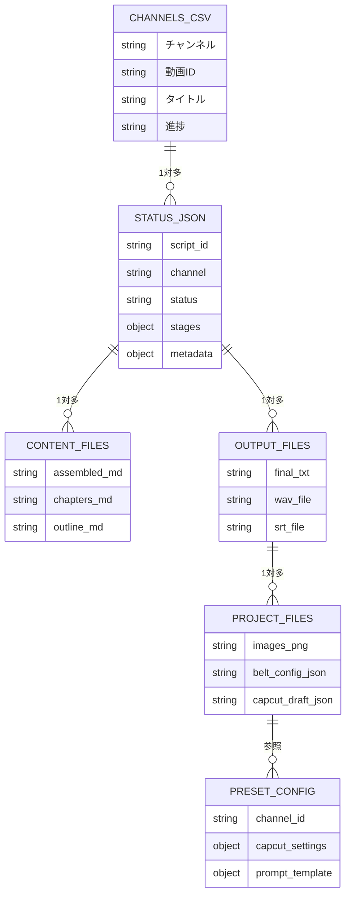

# YouTube Master データモデル定義書

> **最終更新**: 2025-11-19
> **バージョン**: 1.1
> **参照**: `要件定義書.md`, `ssot/README.md`, `spec/channel_config_spec.md`

---

## 目次

1. [データモデル概要](#1-データモデル概要)
2. [SoT（Single Source of Truth）構造](#2-sotsingle-source-of-truth構造)
3. [status.json構造](#3-statusjson構造)
4. [channels CSV構造](#4-channels-csv構造)
5. [JSON構造定義](#5-json構造定義)
6. [データ整合性ルール](#6-データ整合性ルール)

---

## 1. データモデル概要

### 1.1 データ階層

```
youtube_master/
├── progress/                    # 進捗管理（企画・進捗）
│   ├── channels/CHxx.csv        # 企画・進捗SoT
│   ├── personas/CHxx_PERSONA.md # ペルソナ定義
│   └── templates/               # テンプレート
│
├── commentary_01_srtfile_v2/   # 台本・音声
│   └── data/CHxx/<video>/       # 台本・音声SoT
│       ├── status.json          # 進捗状態
│       ├── content/             # 台本コンテンツ
│       └── output/              # 成果物
│
├── commentary_02_srt2images_timeline/  # 画像・動画
│   ├── config/channel_presets.json # チャンネル設定SoT (New)
│   └── output/<project>/        # 動画成果物SoT
│
└── thumbnails/                  # サムネイル
    └── assets/<channel>/<video>/ # サムネ画像SoT
```

### 1.2 データフロー

```
企画 (channels CSV)
    │
    ├─▶ 台本生成 → status.json + content/
    │
    ├─▶ 音声生成 → output/audio/
    │
    ├─▶ 画像生成 → output/<project>/images/
    │
    └─▶ 動画生成 (channel_presets.json) → output/<project>/capcut_draft/
```

---

## 2. SoT（Single Source of Truth）構造

### 2.1 SoT一覧

| 領域 | SoTパス | 形式 | 更新方法 |
|------|---------|------|---------|
| 企画・進捗 | `progress/channels/CHxx.csv` | CSV | `progress_manager`, `planning_store` |
| 台本・音声状態 | `data/CHxx/<video>/status.json` | JSON | `progress_manager` |
| 台本コンテンツ | `data/CHxx/<video>/content/` | Markdown | `qwen/run_stage.py` |
| 音声成果物 | `data/CHxx/<video>/output/audio/` | WAV/SRT/JSON | `audio_manager` |
| 画像・動画 | `output/<project>/` | PNG/JSON | `commentary_02` CLI |
| チャンネル設定 | `commentary_02.../config/channel_presets.json` | JSON | 手動（開発者）/ SSOT定義 |
| サムネイル | `thumbnails/assets/<channel>/<video>/` | PNG | 手動（管理者） |

### 2.2 SoT優先順位

**原則**: `status.json` > `channels CSV`

- 矛盾時は `status.json` を基準に修正
- `channels CSV` は `status.json` のミラー
- 手動編集は禁止（CLI経由のみ）

---

## 3. status.json構造

### 3.1 基本構造

```json
{
  "script_id": "CH06-001",
  "channel": "CH06",
  "status": "script_in_progress",
  "stages": {
    "topic_research": {
      "status": "completed",
      "started_at": "2025-11-18T10:00:00Z",
      "completed_at": "2025-11-18T10:05:00Z"
    },
    "script_outline": {
      "status": "completed",
      "started_at": "2025-11-18T10:05:00Z",
      "completed_at": "2025-11-18T10:10:00Z"
    }
  },
  "metadata": {
    "title": "動画タイトル",
    "ready_for_audio": false,
    "script": {
      "assembled_path": "content/assembled.md"
    },
    "audio": {
      "prepare": {
        "script_sanitized_path": "audio_prep/script_sanitized.txt"
      }
    }
  },
  "created_at": "2025-11-18T10:00:00Z",
  "updated_at": "2025-11-18T10:10:00Z"
}
```

### 3.2 フィールド定義

| フィールド | 型 | 説明 | 必須 |
|-----------|-----|------|------|
| `script_id` | string | `CHxx-###` 形式 | ✅ |
| `channel` | string | チャンネルコード（`CH01`〜`CH06`） | ✅ |
| `status` | string | グローバルステータス | ✅ |
| `stages` | object | 各ステージの状態 | ✅ |
| `metadata` | object | メタデータ | ✅ |
| `created_at` | string | ISO8601形式 | ✅ |
| `updated_at` | string | ISO8601形式 | ✅ |

### 3.3 ステータス値

**グローバルステータス**:
- `pending`: 未着手
- `script_in_progress`: 台本生成中
- `script_ready`: 台本完了
- `script_validated`: 台本検証完了
- `audio_done`: 音声完了
- `images_done`: 画像完了
- `capcut_done`: CapCut完了
- `completed`: 全工程完了

**ステージステータス**:
- `pending`: 未着手
- `processing`: 処理中
- `completed`: 完了
- `failed`: 失敗
- `rerun_requested`: 再実行要求

### 3.4 metadata構造

```json
{
  "metadata": {
    "title": "動画タイトル",
    "ready_for_audio": false,
    "script": {
      "assembled_path": "content/assembled.md",
      "final_path": "output/CHxx-###_final.txt"
    },
    "audio": {
      "prepare": {
        "script_sanitized_path": "audio_prep/script_sanitized.txt"
      },
      "synthesis": {
        "wav_path": "output/audio/CHxx-###_final.wav",
        "srt_path": "output/audio/CHxx-###_final.srt"
      }
    },
    "planning": {
      "video_number": "001",
      "title": "企画タイトル"
    }
  }
}
```

---

## 4. channels CSV構造

### 4.1 基本列

| 列名 | 型 | 説明 | 必須 |
|------|-----|------|------|
| `チャンネル` | string | `CH01`〜`CH06` | ✅ |
| `動画ID` | string | `CHxx-###` 形式 | ✅ |
| `動画番号` | string | `###`（3桁） | ✅ |
| `タイトル` | string | 動画タイトル | ✅ |
| `進捗` | string | ステージ状態 | ✅ |
| `更新日時` | string | `YYYY-MM-DD HH:MM:SS` | ✅ |

### 4.2 企画列（CH01 No.191以降必須）

| 列名 | 型 | 説明 |
|------|-----|------|
| `ターゲット層` | string | 固定ペルソナ文（自動設定） |
| `悩みタグ_メイン` | string | メイン悩みタグ |
| `悩みタグ_サブ` | string | サブ悩みタグ |
| `ライフシーン` | string | ライフシーン |
| `キーコンセプト` | string | キーコンセプト |
| `ベネフィット一言` | string | ベネフィット |
| `たとえ話イメージ` | string | たとえ話 |
| `説明文_リード` | string | 説明文リード |
| `説明文_この動画でわかること` | string | 説明文本文 |

### 4.3 公開列（Phase3）

| 列名 | 型 | 説明 |
|------|-----|------|
| `公開タイトル` | string | YouTube公開タイトル |
| `公開説明文` | string | YouTube説明文 |
| `公開タグ` | string | タグ（カンマ区切り） |
| `サムネID` | string | サムネID |
| `サムネファイル` | string | サムネファイルパス |
| `投稿予定時刻` | string | ISO8601形式 |
| `承認者` | string | 承認者名 |
| `承認日時` | string | ISO8601形式 |
| `投稿ステータス` | string | `pending`/`approved`/`posted` |
| `youtube_video_id` | string | YouTube動画ID |

### 4.4 CSV例

```csv
チャンネル,動画ID,動画番号,タイトル,進捗,ターゲット層,悩みタグ_メイン,説明文_リード,更新日時
CH06,CH06-001,001,【警告】○○するな,script_validation: completed,都市伝説好きの20-30代男性,不安,あなたは知っていますか？,2025-11-18 10:00:00
```

---

## 5. JSON構造定義

### 5.1 belt_config.json

```json
{
  "version": 1,
  "episode_id": "CH06-001",
  "main_belt": {
    "text": "メイン帯テキスト",
    "start_time": 0.0,
    "end_time": 300.0
  },
  "sub_belts": [
    {
      "id": "sub_1",
      "text": "サブ帯テキスト1",
      "start_time": 10.0,
      "end_time": 30.0
    }
  ]
}
```

### 5.2 image_cues.json

```json
{
  "version": 1,
  "episode_id": "CH06-001",
  "chunks": [
    {
      "chunk_id": "chunk_001",
      "start_time": 0.0,
      "end_time": 10.0,
      "text": "チャンクテキスト",
      "image_prompt": "画像生成プロンプト",
      "image_path": "images/chunk_001.png",
      "character_profile": {
        "age": "30代",
        "gender": "男性",
        "appearance": "シルエット"
      }
    }
  ]
}
```

### 5.3 capcut_draft_info.json

```json
{
  "version": 1,
  "project_id": "CH06-001",
  "channel": "CH06",
  "video_number": "001",
  "draft_path": "~/Movies/CapCut/User Data/Projects/com.lveditor.draft/CH06-001_完成版",
  "draft_name": "CH06-001_完成版",
  "created_at": "2025-11-18T10:00:00Z",
  "images_count": 30,
  "belt_layers_count": 5,
  "audio_duration": 600.0
}
```

### 5.4 timeline.json（音声）

```json
{
  "version": 1,
  "episode_id": "CH06-001",
  "audio_file": "output/audio/CH06-001_final.wav",
  "srt_file": "output/audio/CH06-001_final.srt",
  "segments": [
    {
      "segment_id": "seg_001",
      "start_time_ms": 0,
      "end_time_ms": 10000,
      "text": "セグメントテキスト",
      "chunk_id": "chunk_001"
    }
  ]
}
```

### 5.5 channel_presets.json (チャンネル別設定)

**概要**: チャンネルごとの動画スタイル（プロンプト、CapCut設定）を定義するSoT。

```json
{
  "channels": {
    "CH01": {
      "name": "人生の道標",
      "capcut_template": "CH01-UNK_道標_最新テンプレ",
      "belt": {
        "enabled": true,
        "opening_offset": 3.0
      },
      "capcut_settings": {
        "subtitle": {
          "font_size": 5.0,
          "text_color": "#FFFFFF",
          "background": {
             "enabled": true,
             "color": "#000000",
             "round_radius": 0.4,
             "horizontal_offset": -1.0,
             "vertical_offset": -1.0
          }
        },
        "timeline": {
          "opening_offset_sec": 3.0
        }
      }
    }
  }
}
```

詳細仕様は `spec/channel_config_spec.md` を参照。

---

## 6. データ整合性ルール

### 6.1 整合性チェック

**必須チェック**:
1. `status.json.script_id` = `channels CSV.動画ID`
2. `status.json.channel` = `channels CSV.チャンネル`
3. `status.json.stages` と `channels CSV.進捗` の一致
4. ファイル存在チェック（`content/`, `output/`）

**実行タイミング**:
- Stage実行前後（`validate-status --context stage:pre/post`）
- 夜間スイープ（`validate_status_sweep.py --context nightly`）
- UI操作時（`/api/channels/{code}/videos/{video}`）

### 6.2 修復ルール

**自動修復**:
- `progress_manager repair-status --auto-complete`
- `status.json` を基準に `channels CSV` を更新

**手動修復**:
- `progress_manager set-status --status <value>`
- `progress_manager update-stage --stage <name> --state <state>`

### 6.3 同期ルール

**更新順序**:
1. `status.json` 更新
2. `channels CSV` 更新（`progress_manager`経由）
3. `planning_store.refresh(force=True)` でキャッシュ更新

**禁止事項**:
- CSV手動編集
- `status.json` と `channels CSV` の直接編集
- 複数ツールでの同時更新

---

## 付録

### A. データモデル図



### B. 参照ドキュメント

- **要件定義**: `spec/要件定義書.md`
- **システム設計**: `spec/システム設計書.md`
- **運用仕様**: `ssot/OPS_PLANNING_CSV_WORKFLOW.md`
- **台本ワークフロー**: `ssot/OPS_SCRIPT_GUIDE.md`
- **チャンネル設定仕様**: `spec/channel_config_spec.md`

---

**本データモデル定義書は実装と整合性を保ち、構造変更時は必ず更新すること。**
# データモデル定義書 (Update v1.2)

> **最終更新**: 2025-11-19
> **バージョン**: 1.2
> **変更点**: 型定義（Domain Schema）の導入、SSOTファイルの拡張

---

## 2. SoT（Single Source of Truth）構造

### 2.1 SoT一覧（更新）

| 領域 | SoTパス | 形式 | 実装モデル | 更新方法 |
|------|---------|------|------------|---------|
| チャンネル設定 | `config/channel_presets.json` | JSON | `ChannelRegistry` | 手動（開発者） |
| スタイル定義 | `config/master_styles_v2.json` | JSON | `VideoStyle` | 手動（開発者） |
| 画像指示 | `output/.../image_cues.json` | JSON | `ImageCuesData` | LLM生成 |

---

## 7. 型定義（Domain Schema）

システム全体で共有されるPydanticモデル定義。
`src/core/domain/` 配下に配置し、UI/API/CLI共通で利用する。

### 7.1 スタイル定義 (`style_schema.py`)

動画の構成要素を論理的に定義するスキーマ。

```python
class VideoStyle(BaseModel):
    name: str
    canvas_width: int = 1920
    canvas_height: int = 1080
    subtitle_style: TextStyle
    belt_style: Optional[TextStyle]
    audio: AudioMixing
    visual: VisualStyle
    structure: TimelineStructure
    platform_overrides: dict  # CapCut/Remotion固有値
```

**TextStyle**:
- `font_family`, `font_size_pt`, `text_color` (Hex)
- `background_enabled`, `background_color`, `background_opacity`
- `position_x`, `position_y`, `alignment` (Logical: -1.0 to 1.0)

### 7.2 チャンネル設定 (`channel_schema.py`)

`channel_presets.json` の構造定義。

```python
class ChannelConfig(BaseModel):
    name: str
    status: str = "active"
    capcut_template: Optional[str]
    position: ChannelPosition  # tx, ty, scale
    belt: BeltConfig          # enabled, offset
    video_style: Optional[VideoStyle]
    capcut_settings: Optional[CapCutSettings] # Legacy override
```

### 7.3 アセット定義 (`asset_schema.py`)

`image_cues.json` の構造定義。

```python
class ImageCue(BaseModel):
    start_sec: float
    end_sec: float
    duration_sec: float
    content: str
    image_prompt: str
    image_path: Optional[str]

class ImageCuesData(BaseModel):
    fps: int = 30
    size: dict
    cues: List[ImageCue]
```

---

## 8. Platform Adapter

論理的なスタイル定義 (`VideoStyle`) を各プラットフォームの実装値に変換する層。

### 8.1 CapCut Adapter (`style_mapper.py`)

*   **入力**: `VideoStyle`
*   **出力**: `pyJianYingDraft` 用の辞書 (`Text_style`, `Clip_settings` 等)
*   **変換ロジック**:
    *   座標変換: Logical Y (0.8) → CapCut Y (-0.8)
    *   サイズ変換: Font pt → CapCut internal size
    *   色変換: Hex (`#FFFFFF`) → RGB Tuple (`(1.0, 1.0, 1.0)`)

---

**UI実装者への注記**:
フォーム生成やバリデーションには、必ず `src/core/domain/*.py` のPydanticモデルを参照すること。生のJSON操作は禁止とする。
