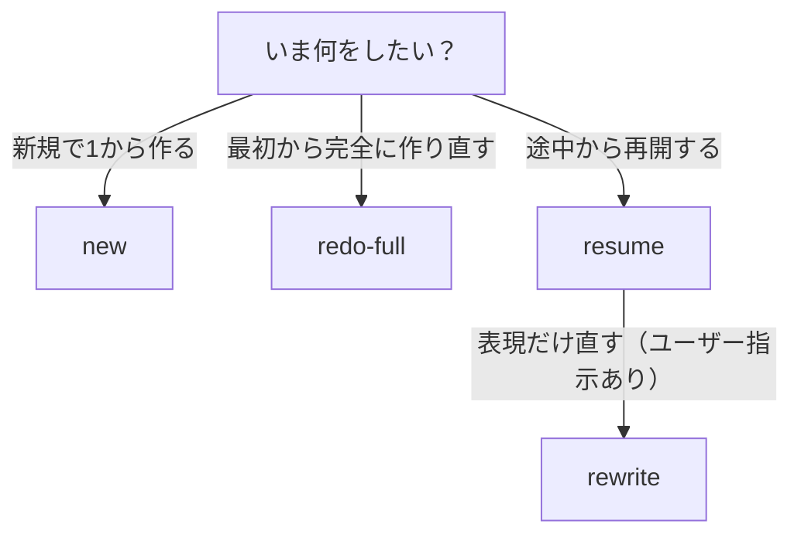
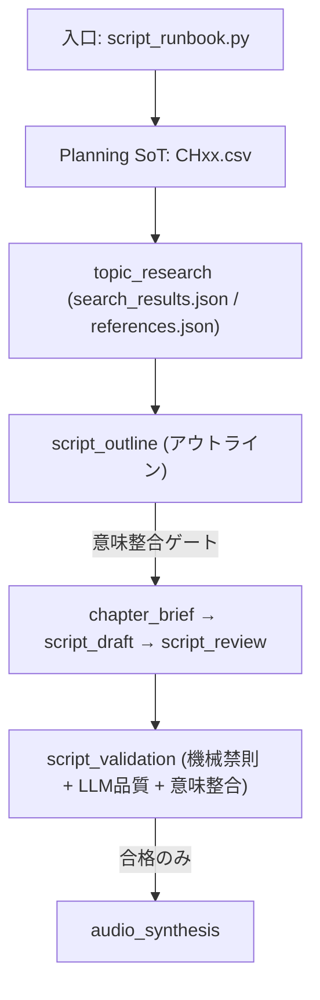

# OPS_SCRIPT_FACTORY_MODES — 台本工場（入口固定 / 4パターンSSOT）

目的:
- 「タイトル/企画の趣旨からズレた台本」を **仕組みで止める**。
- 大量運用のため、**叩く入口を1つに固定**し、運用パターンを4つに限定する。
- 人間がフローを100%追えるように、**図（分岐）とSoT** を固定する（迷ったらこのSSOTを正とする）。

このSSOTは「複雑な仕様書」ではなく、運用者が迷わないための **1枚設計図**。

関連（詳細）:
- 台本量産ロジック（単一SSOT）: `ssot/ops/OPS_SCRIPT_PIPELINE_SSOT.md`
- 台本運用（入口/手順）: `ssot/ops/OPS_SCRIPT_GUIDE.md`
- 確定フロー（観測ベース正本）: `ssot/ops/OPS_CONFIRMED_PIPELINE_FLOW.md`
- 入力契約（タイトル=正 / 補助 / 禁止）: `ssot/ops/OPS_SCRIPT_INPUT_CONTRACT.md`
- 意味整合ゲート（タイトル/サムネ↔台本）: `ssot/ops/OPS_SEMANTIC_ALIGNMENT.md`

---

## 0) これだけ覚える（最重要）

- **タイトルが絶対に正（SoT）**: Planning CSV の `タイトル` 列が基準。タイトルと別テーマに寄ったら不合格。
- **入口は1つだけ**: `scripts/ops/script_runbook.py`（下にコマンド固定）。
- **成功条件（Done）**: `script_validation` が `completed`（= “通った台本だけ” を下流へ渡す）。
- **機械チェック（LLMなし）は安全弁**: 形式崩れ/ぶつ切り/段落重複などの「壊れ方」を止めるだけ。内容や言い回しを固定しない。
- 不明点が出たら勝手に解釈しない（運用者に確認する）。

---

## 用語（このSSOT内の定義）

- 企画取り違え（=混線/混入。旧称: Planning混線）:
  - **Planning CSV の1行の中で、別動画の情報が混ざっている状態**（典型: タイトル先頭の【…】と、企画要約先頭の【…】が不一致）。
  - これが起きると「タイトルはAなのに、本文生成がBに引っ張られる」事故の原因になる。
  - 対処: `workspaces/planning/channels/CHxx.csv` の該当行を修正（混線を解消）→再実行。
  - 早期停止（任意）: `SCRIPT_BLOCK_ON_PLANNING_TAG_MISMATCH=1` で高コスト工程の前に止められる。
- 内容汚染:
  - **別の動画の企画要約/タグ等が混ざって、タイトルと別テーマのヒントが入っている状態**。
  - 例: タイトルは「縁」なのに、企画要約が「朝習慣」の話になっている。
- 決定論（deterministic）:
  - 同じ入力→同じ出力になる処理（LLMを呼ばない）。目的は「再現性」と「事故防止」。
- 自動安全フォールバック（LLMなし。旧称: 決定論フォールバック）:
  - LLMの出来に依存せず「事故を止める」ための安全弁。**文章を新規に書かず**、末尾ぶつ切りのトリム/重複段落の削除/禁則の修復など「壊れ方」だけを直す（内容品質を下げるためではない）。
  - 重要: フォールバック後も `validate_a_text`（機械ルール）に通らなければ **書き込まずに停止**する。中途半端な台本を“合格扱い”にする仕組みではない。
  - 証跡は `status.json: stages.script_validation.details` に残る。
- 機械チェック（=非LLM）:
  - コードで確実に判定できる禁則/字数/区切りなどを、**LLMに頼らず**チェックする。
  - 目的は「質を下げる」ではなく、**事故を確実に止める**こと。
- 生成物の保持/削除:
  - 正本: `ssot/plans/PLAN_OPS_ARTIFACT_LIFECYCLE.md`（このSSOTでは略称を前提にしない）。

---

## 1) 入口（絶対固定）

台本パイプラインの運用入口は **これだけ**。

- `./scripts/with_ytm_env.sh .venv/bin/python scripts/ops/script_runbook.py <MODE> ...`

※ `python -m script_pipeline.cli ...` は低レベルCLI（内部/詳細制御用）。**日常運用では入口を増やさない**。

---

## 2) SoT（正本）— ここだけ見れば迷子にならない

- Planning SoT（企画の正本）: `workspaces/planning/channels/CHxx.csv`
- Script SoT（ステージ状態の正本）: `workspaces/scripts/{CH}/{NNN}/status.json`
- 台本本文（Aテキストの正本）:
  - 優先: `workspaces/scripts/{CH}/{NNN}/content/assembled_human.md`
  - 代替（ミラー）: `workspaces/scripts/{CH}/{NNN}/content/assembled.md`

原則:
- **正本は1つ**（SoTを増やすとズレが増える）。
- `assembled_human.md` がある場合、`assembled.md` を手編集しない（内容汚染の元）。

---

## 3) 判断フロー（図）— まずこれだけ

### 3.1 分岐図（Mermaid / 視覚用）



### 3.2 分岐図（テキスト / コピペ可）

```
            ┌───────────────────────────┐
            │ 今やりたいのはどれ？       │
            └───────────────┬───────────┘
                            │
          ┌─────────────────┼─────────────────┐
          │                 │                 │
      新規で作る         完全に作り直す      途中から続ける
     (status無し)     (作り直し確定)       (status有り)
          │                 │                 │
        new            redo-full            resume
                                              │
                                              └── 言い回し等の修正だけ？
                                                  （指示が必須）
                                                      │
                                                   rewrite
```

### 3.3 パイプライン（stage）図（入口→検証→合格）



---

## 4) 4つの運用パターン（これ以外は増やさない）

「どれを叩くか」だけを固定する。細かい実装やステージは `OPS_SCRIPT_PIPELINE_SSOT.md` 側で扱う。

### 4.1 new（新規で1から台本を書く）

用途:
- `status.json` が無い（新規エピソード）。
- 企画CSV（タイトル/サムネ/企画意図）を元に、台本を最初から生成したい。

入口:
- `./scripts/with_ytm_env.sh .venv/bin/python scripts/ops/script_runbook.py new --channel CHxx --video NNN`

何が起きる:
- `workspaces/scripts/{CH}/{NNN}/status.json` を作り、ステージを進めて `script_validation` まで行く。

成功条件（Done）:
- `script_validation` が `completed`（台本合格）。音声はまだ作らない。

### 4.2 redo-full（最初から完全にやり直す）

用途:
- 内容がズレている/破綻している/混入しているため「修正」ではなく「作り直し」。
- 企画CSVが変わった（旧台本を引きずると事故る）。

入口:
- `./scripts/with_ytm_env.sh .venv/bin/python scripts/ops/script_runbook.py redo-full --channel CHxx --from NNN --to MMM`
  - 調査も消す（高確度で混入源を潰す）: `--wipe-research`

何が起きる:
- 対象回を `reset` してから、`script_validation` まで再生成する（=旧台本を引きずらない）。

成功条件（Done）:
- 対象回すべてで `script_validation` が `completed`。

### 4.3 resume（途中から再開）

用途:
- 途中で止まった（LLM失敗/手動介入/中断）。
- 既存出力を活かして、未完了ステージだけ進めたい。

入口:
- `./scripts/with_ytm_env.sh .venv/bin/python scripts/ops/script_runbook.py resume --channel CHxx --video NNN`

成功条件（Done）:
- `script_validation` が `completed`。

### 4.4 rewrite（リライト修正：ユーザー指示が必須）

用途:
- 「言い回しをもっと理解しやすく」など **意図は同じで表現を直す**。
- タイトル/企画の主題は変えない（変えるなら `redo-full`）。

必須入力（どちらか）:
- `--instruction "<指示>"`
- `--instruction-file <path>`

入口:
- `./scripts/with_ytm_env.sh .venv/bin/python scripts/ops/script_runbook.py rewrite --channel CHxx --video NNN --instruction \"...\"`

正本の扱い:
- 出力は `content/assembled_human.md`（正本）に反映する。
- 反映後は `script_validation` を必ず再実行し、OKになった台本だけ下流（音声）へ進む。

---

## 5) ズレ/破綻を止める仕組み（要点だけ）

ズレ事故の主因:
- Planning CSV 行の内容汚染（タイトル【…】と企画要約【…】が別テーマ）
- 企画要約/タグ等の「テーマヒント」の汚染が、本文生成を別テーマへ引っ張る
- 長尺を「全文LLM」で回して、途中で迷子/反復/薄まりが起きる

仕組み（正本）:
- 企画取り違え（混線）の早期検知（任意）:
  - `SCRIPT_BLOCK_ON_PLANNING_TAG_MISMATCH=1` で、高コスト工程（research/outline/draft）の前に停止できる（デフォルトOFF）。
- 入力契約（タイトル=正 / 補助 / 禁止）で **内容汚染を検知したら、タイトルを正として汚染されやすいテーマヒントを無視**: `ssot/ops/OPS_SCRIPT_INPUT_CONTRACT.md`
- `script_validation` で「禁則（機械チェック）」→「内容品質（LLM Judge）」→「意味整合（タイトル/サムネ↔台本）」を通す（“通った台本だけ” を次へ）
  - 意味整合の判定は `ok / minor / major`。**デフォルトは `major` のみ停止**（`minor` はログに残す）。厳密に止めたい場合は `SCRIPT_VALIDATION_SEMANTIC_ALIGNMENT_REQUIRE_OK=1`。
- 超長尺は Marathon（全文LLM禁止・章単位収束）: `ssot/ops/OPS_LONGFORM_SCRIPT_SCALING.md`

---

## 6) 補助（4パターン以外。運用のズルはここに隔離）

大量検証で「再生成せず、今ある台本が通るかだけ見たい」場合:
- `./scripts/with_ytm_env.sh .venv/bin/python scripts/ops/script_runbook.py redo --channel CHxx --from NNN --to MMM --mode validate`

注意:
- これは “作り直し” ではなく “検査”。
- NGが多い場合は `redo-full` に切り替える（混入を引きずらない）。
