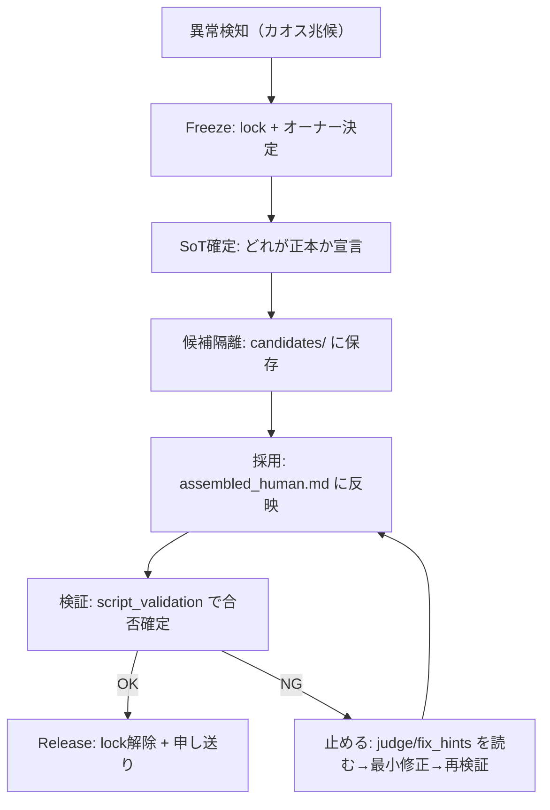

# OPS_SCRIPT_INCIDENT_RUNBOOK — 台本カオス時（複数エージェント競合）の止血・復帰（SSOT）

目的:
- 「誰かが直している最中に別の誰かが上書きして壊れる」「正本が分からない」「コストだけ増える」事故を止める。
- codex / windsurf / antigravity 等、**どのエージェントでも同じ手順**で復旧できるように固定する。

関連（正本）:
- エージェント運用（lock/board/memo）: `ssot/ops/OPS_AGENT_PLAYBOOK.md`
- 台本工場（入口固定/5モード）: `ssot/ops/OPS_SCRIPT_FACTORY_MODES.md`
- 台本運用（入口/手順）: `ssot/ops/OPS_SCRIPT_GUIDE.md`
- 台本量産ロジック（単一SSOT）: `ssot/ops/OPS_SCRIPT_PIPELINE_SSOT.md`
- SoT（正本の場所）: `ssot/ops/OPS_SCRIPT_SOURCE_MAP.md`

---

## 0) 結論（カオス時はこの5手だけ）

1) **止血（Freeze）**: 対象エピソードの SoT を lock して「書く人を1人」に固定  
2) **正本を宣言**: `assembled_human.md`（無ければ `assembled.md`）を「本文の正本」として固定  
3) **候補は隔離**: どのエージェントの書き直しも、まずは “候補ファイル” として保存（SoTへ直書きしない）  
4) **採用→検証**: 採用した候補だけを正本へ反映し、`script_validation` を通して合否を確定  
5) **解除（Release）**: ロック解除 + 短い申し送り（memo/board）で終える

---

## 1) これが起きたら「カオス」扱いで止血する

- 同じ回で `assembled.md` と `assembled_human.md` の内容がズレている
- `content/analysis/**/fix_latest.md` はあるのに本文に反映されていない（どれが採用か不明）
- `status.json` が `processing` のまま（途中で止まった/タイムアウト）
- 文字数などの設定を変えたのに、既存回が古い設定のまま動き続けている
- 複数エージェントが同一回を「執筆/修正/検証」している（上書き競合の恐れ）

---

## 2) 絶対ルール（どのエージェントでも共通）

- **1エピソード = 1オーナー**（書く/採用する/検証する責任者は1人）
- **SoT（正本）は固定**:
  - 企画 SoT: `workspaces/planning/channels/CHxx.csv`
  - 状態 SoT: `workspaces/scripts/{CH}/{NNN}/status.json`
  - 本文 SoT: `workspaces/scripts/{CH}/{NNN}/content/assembled_human.md`（無ければ `assembled.md`）
- `content/analysis/**` は **正本ではない**（候補/ログ/証跡）
- **入口は固定**（執筆/やり直し/再開/リライト/seed-expand はこれだけ）:
  - `./scripts/with_ytm_env.sh python3 scripts/ops/script_runbook.py <MODE> ...`
- “候補” を出すエージェントは、**SoTを直接書き換えない**（候補ファイルを出すだけ）

---

## 3) 復旧フロー（視覚）



---

## 4) 手順（コピペ用コマンド）

以降は **どのエージェントUIでも同じ**。ターミナルから実行する。

### 4.1 Freeze（まず止血）

1) lock の有無を確認（必須）:
```bash
python scripts/agent_org.py locks --path "workspaces/scripts/CH23/001/status.json"
python scripts/agent_org.py locks --path "workspaces/scripts/CH23/001/content/assembled.md"
python scripts/agent_org.py locks --path "workspaces/scripts/CH23/001/content/assembled_human.md"
```

2) 触る範囲に lock を置く（必須。globは必ずクォート）:
```bash
python scripts/agent_org.py lock --mode no_write --ttl-min 60 --note "INCIDENT: freeze CH23-001" \
  "workspaces/planning/channels/CH23.csv" \
  "workspaces/scripts/CH23/001/status.json" \
  "workspaces/scripts/CH23/001/content/assembled*.md" \
  "configs/sources.yaml"
```

3) オーナーを宣言（標準: memo。boardでも可）:
```bash
python scripts/agent_org.py memo --to "*" --subject "[INCIDENT][script] freeze CH23-001 owner=<YOUR_NAME>" --body "SoT固定のため一時停止。候補は candidates/ に隔離して提出してください。"
```

### 4.2 候補隔離（SoTへ直書きしない）

候補はここに置く（例）:
- `workspaces/scripts/CH23/001/content/analysis/incident_YYYYMMDDTHHMMSSZ/candidates/<agent>.md`

（例: ディレクトリ作成）
```bash
ts=$(date -u +"%Y%m%dT%H%M%SZ")
mkdir -p "workspaces/scripts/CH23/001/content/analysis/incident_${ts}/candidates"
```

### 4.3 採用（本文の正本に反映）

採用ルール:
- 正本があるなら `assembled_human.md` を更新（無いなら `assembled.md`）
- 反映したら **必ず** `script_validation` を回す

### 4.4 検証（合否確定）

入口固定:
```bash
./scripts/with_ytm_env.sh python3 scripts/ops/script_runbook.py resume --channel CH23 --video 001
```

「途中で止まった/processingのまま」を直す（LLMなし・安全弁。必要時のみ）:
```bash
./scripts/with_ytm_env.sh python3 -m script_pipeline.cli reconcile --channel CH23 --video 001
```

### 4.5 Release（解除）

- `script_validation=completed` になったら、lock を解除して memo/board に「どれを採用したか」を残す
- NG のままなら、**採用しない**（次工程へ流さない）。judge/fix_hints を読んで最小修正→再検証

---

## 5) “やってはいけない”一覧（事故の再発防止）

- 候補エージェントが `assembled*.md` を直接上書きする
- `content/analysis/**` の `fix_latest.md` を「正本」と誤解して下流へ流す
- 文字数/チャンネル設定を変えたのに、既存エピソードを古い `status.json` のまま検証して混乱する
- lock を置かずに同じ回を複数人が触る
