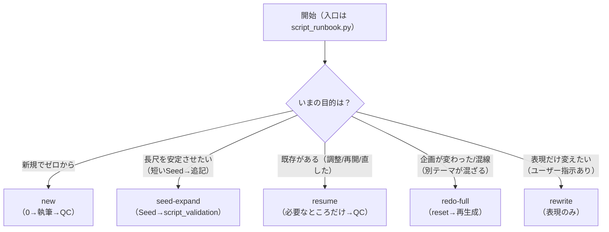
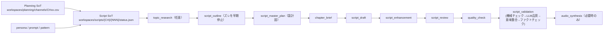

# OPS_SCRIPT_PIPELINE_SSOT — 台本量産ロジックの正本（新規/やり直し/超長尺）

目的:
- 「台本が破綻する/水増しする/タイトルとズレる/同じ話を繰り返す」事故を、**手作業やリトライではなく仕組み**で止める。
- 新規作成とやり直し（Redo）を、低知能エージェントでも迷わず実行できる **確定フロー**にする。
- 2〜3時間級（超長尺）でも破綻しない運用を、**一発の全文生成は禁止**（章/ゲートで収束）を前提に固定する。

この文書は「台本パイプラインの単一SSOT（1枚）」である。詳細は必要時にリンク先へ降りるが、**迷ったら本書の手順を優先**する。

推奨実行（共通）:
- **必ず** `./scripts/with_ytm_env.sh python3 ...` を使う（.envロード + PYTHONPATH固定）。
  - `python -m ...` 直叩きは環境差分（依存不足）で詰まりやすい。
  - 日常運用の入口（固定）: `./scripts/with_ytm_env.sh python3 scripts/ops/script_runbook.py <MODE> ...`
    - モード（new/redo-full/resume/rewrite/seed-expand）の正本: `ssot/ops/OPS_SCRIPT_FACTORY_MODES.md`
  - 例（新規）: `./scripts/with_ytm_env.sh python3 scripts/ops/script_runbook.py new --channel CH10 --video 008`
  - 例（Seed→Expand）: `./scripts/with_ytm_env.sh python3 scripts/ops/script_runbook.py seed-expand --channel CH10 --video 008`
  - 例（途中再開）: `./scripts/with_ytm_env.sh python3 scripts/ops/script_runbook.py resume --channel CH07 --video 019`

---

## QUICK START（迷ったらこれだけ / 入口は固定）

目的 → 叩くコマンド（入口固定）:
- **新規でゼロから執筆**: `script_runbook.py new`
- **最初から完全にやり直す（既存を捨てて作り直し）**: `script_runbook.py redo-full`
- **途中から再開 / 既存台本を調整して合格させる**（体裁/品質/整合を再検証）: `script_runbook.py resume`
- **リライト修正（ユーザー指示が必須）**: `script_runbook.py rewrite`
- **長尺を安定させたい（短い本文Seed→追記で収束）**: `script_runbook.py seed-expand`

判断の最小ルール:
- 「本文を直した/ターゲット字数が変わった/タイトルが変わった」→ `resume --until script_validation`（再検証だけ回すのが最安）
- 「プロンプト/QC/ルールを更新したので、同じ本文でも検証を回し直したい」→ `resume --until script_validation --force-script-validation`
- 「企画（CSV）が変わった/混線している」→ `redo-full`（旧生成物を引きずらないのが最安）
- 「表現だけ変えたい（主題は変えない）」→ `rewrite`（ユーザー指示なしでは使わない）

Mermaid（入口選択の1枚図）:



関連（詳細/分割SSOT）:
- 確定E2Eフロー（観測ベースの正本）: `ssot/ops/OPS_CONFIRMED_PIPELINE_FLOW.md`
- 入口固定（5パターン運用）: `ssot/ops/OPS_SCRIPT_FACTORY_MODES.md`
- 台本アーキテクチャ（構造で壊さない）: `ssot/ops/OPS_SCRIPT_GENERATION_ARCHITECTURE.md`
- 入力契約（タイトル=正 / 補助 / 禁止）: `ssot/ops/OPS_SCRIPT_INPUT_CONTRACT.md`
- 運用手順（入口/やり直し）: `ssot/ops/OPS_SCRIPT_GUIDE.md`
- 品質ゲート（Judge→Fixer→必要ならRebuild）: `ssot/ops/OPS_A_TEXT_LLM_QUALITY_GATE.md`
- 超長尺（Marathon）設計: `ssot/ops/OPS_LONGFORM_SCRIPT_SCALING.md`
- 構成パターン（骨格/字数配分SSOT）: `ssot/ops/OPS_SCRIPT_PATTERNS.yaml`

---

## 0) SoT（正本）とI/O（迷子を止める固定）

用語（本書内の定義）:
- 内容汚染: 別動画の企画要約/タグ等が混ざり、タイトルと別テーマのヒントが入っている状態。
- 機械チェック（=非LLM）: コードで確実に判定できる禁則/字数/区切りなどを、LLMに頼らず止めるチェック。

SoT（正本）:
- Planning SoT（企画/進捗）: `workspaces/planning/channels/CHxx.csv`
- Script SoT（台本ステージ状態）: `workspaces/scripts/{CH}/{NNN}/status.json`
- 台本本文（Aテキスト）:
  - 正本: `workspaces/scripts/{CH}/{NNN}/content/assembled_human.md`（存在する場合）
  - 代替（ミラー）: `workspaces/scripts/{CH}/{NNN}/content/assembled.md`
  - 注意: `assembled.md` は mirror 扱い（最終的に `assembled_human.md` と一致させる）

証跡/ログ（参照はできるが正本ではない）:
- ステージごとの入出力: `workspaces/scripts/{CH}/{NNN}/logs/{stage}_prompt.txt`, `.../{stage}_response.json`
- 研究/判定ログ: `workspaces/scripts/{CH}/{NNN}/content/analysis/**`

### 0.2 「機械チェック」と「LLM」の役割分担（柔軟性を失わないために）

結論:
- **機械チェック（LLMなし）**は「壊れ方を止める安全弁」。内容を固定しない。
- **LLM**は「内容の設計/執筆/意味整合/自然さの合否」を担当する。

機械チェック（LLMなし）がやること（例）:
- 形式/禁則: URL、脚注、箇条書き、区切り記号の混入を止める
- 破損検知: 末尾ぶつ切り（未完）、同一段落の丸ごと重複などを検出して止める（内容を“勝手に直して合格扱い”にしない）
- 安全な機械修復（OK）: **内容に触れない形式レベル**の正規化だけ（例: 行内 `---` を1行単独へ、制作メタ混入の除去）
  - 重要: 末尾トリム/重複段落削除/機械トリムなど **内容に触れる決定論修正**はデフォルト無効（`SCRIPT_VALIDATION_DETERMINISTIC_CONTENT_REPAIRS=0`）。

LLMがやること（柔軟性が必要な領域）:
- アウトライン設計（`script_outline`）と章執筆（`script_draft`）
- 内容品質（薄い/冗長/流れが悪い）を Judge して、必要なら最小リライト（`script_validation` の LLM品質ゲート）
- タイトル/サムネ訴求 ↔ 台本コアの「意味整合」（minor/major の判定 + 最小リライト）

柔軟性を“どこに集約するか”（入口固定の前提）:
- 企画の変更は Planning SoT（タイトル/企画意図/構成案）で吸収する
- 表現だけを変える要求は `rewrite`（ユーザー指示必須）で吸収する
- それ以外の例外を機械ルールに押し込まない（入口/判断を増やすとズレが増える）

### 0.3 Web検索（補助）の扱い（コスト/内容汚染を増やさない）

結論:
- Web検索は **補助**。タイトル/企画の主題を変えるために使わない。
- やりすぎるとコストと内容汚染が増えるため、**チャンネルごとに実行可否を固定**する（SoT）。

SoT（チャンネル別ポリシー）:
- `configs/sources.yaml: channels.CHxx.web_search_policy`（default: `auto`。ただし運用では明示設定を推奨）
  - `disabled`: 検索しない（`search_results.json` は必ず `provider=disabled, hits=[]` を書く）
  - `auto`: 通常どおり検索を試す（provider は `YTM_WEB_SEARCH_PROVIDER`。失敗してもパイプラインは止めない）
  - `required`: 検索を必ず試す（失敗してもパイプラインは止めないが、`status.json` に decision/reason が残る）

いまのデフォルト（= `configs/sources.yaml` の現行設定）:
- `disabled`: CH05
- `required`: CH01, CH02, CH03, CH04, CH06〜CH26

内容汚染対策（設計）:
- 検索結果は `topic_research` の **参考URL/論点抽出**に限定し、本文の主題はタイトルに従う。
- `search_results.json` / `references.json` は本文（Aテキスト）へ混入させない（URL/脚注は禁止）。

### 0.3.1 Wikipedia（補助）の扱い

結論:
- Wikipedia は **補助**。タイトル/企画の主題を変えるために使わない。
- チャンネルによっては内容汚染の原因になるため、**チャンネルごとに実行可否を固定**する（SoT）。

SoT（チャンネル別ポリシー）:
- `configs/sources.yaml: channels.CHxx.wikipedia.policy`（default: `auto`）
  - `disabled`: 実行しない（`wikipedia_summary.json` は `provider=disabled` を必ず書く）
  - `auto`: 通常どおり参照を試す（見つからない/失敗してもパイプラインは止めない）
  - `required`: 参照を必ず試す（失敗してもパイプラインは止めないが、`status.json` に decision/reason が残る）
- 出力: `workspaces/scripts/{CH}/{NNN}/content/analysis/research/wikipedia_summary.json`

内容汚染対策（設計）:
- Wikipedia の URL/出典を **本文へ直接書かない**（Aテキスト禁則）。
- Wikipedia は「用語/人物/概念の導入・同定」の足場として使い、本文の裏取りは必要なら Web検索（search_results.json）で補強する。

### 0.4 文字数ターゲット（長文でも崩さないためのSSOT）

SoT（正本）:
- チャンネル既定: `configs/sources.yaml: channels.CHxx.target_chars_min/max`
- エピソードのキャッシュ: `workspaces/scripts/{CH}/{NNN}/status.json metadata.target_chars_min/max`

重要:
- `status.json` は「実行時の入力・判断」を固定するため、`configs/sources.yaml` を更新しても **既存エピソードは自動では伸びない**（=古い target のまま通ってしまう）ことがある。
- 入口（固定）である `scripts/ops/script_runbook.py` は、実行開始時に `status.json` の `target_chars_*` を `configs/sources.yaml` に同期する（本文は書き換えない）。
  - 同期の証跡: `metadata.targets_synced_at`, `metadata.targets_synced_from`
  - 旧ターゲットで `script_validation` が `completed` だった場合は `pending` に戻して再検証する（基準が変わったため）
- 参考: `python -m script_pipeline.cli` を直叩きする場合も、同様に target を同期する（安全弁）。

運用:
- チャンネル既定の target を変えたら、対象回だけ `resume` / `redo-full` で再検証する（LLMコストが増えるので必要回に限定）。
  - 例: CH10 の下限を 8k→15k に上げた場合、過去回は `script_validation` で **追記（extend/expand）** を実行して下限へ収束させる。

例外（その回だけ手動固定したい場合）:
- `status.json metadata.targets_locked=1` を設定すると、入口の同期を止められる（推奨はしない。実験用）。

### 0.1 全体像（1枚で把握）

運用者が迷子にならないための “固定の流れ” はこれ。

```
Planning SoT (CSV) ──┐
persona/prompt/pattern ─┤  → status.json（ステージ管理）
                      └───────────────┐
                                      v
topic_research（任意）
  v
script_outline（ここで “ズレ” を早期停止: 安い）
  v
script_master_plan（設計図 / master_plan.json）
  v
chapter_brief
  v
script_draft → script_enhancement → script_review → quality_check
  v
 script_validation（禁則=機械チェック + 内容=LLM + 意味整合=LLM + ファクトチェック）
  v
audio_synthesis（必要時のみ）
```

Mermaid（視覚用）:



覚え方（概念）:
- SPEC（設計）→ WRITE（執筆）→ ASSEMBLE（結合/磨き込み）→ PATCH（検査/最小修正）

補足（壊れ方の吸収 / 再現性）:
- `chapter_brief` の出力 `content/chapters/chapter_briefs.json` は「機械で読めるJSON」が契約だが、LLMが稀に前置き文を混ぜることがある。  
  この場合は **最初の `[`〜最後の `]`** を抽出してJSON配列として読み取る（内容を“解釈で改変”しないための堅牢化）。

---

## 1) 入力契約（タイトル=正 / 補助 / 禁止）

台本生成の品質は「プロンプトの長さ」より **入力の扱い**で決まる。

### 1.1 タイトル（絶対正）
- 企画タイトル（Planning SoT の `タイトル` 列）
- タイトルからズレた内容は不合格（語句一致ではなく “意味として” のズレを止める）

### 1.2 補助（使って良いが、タイトルと矛盾したら捨てる）
- persona / channel_prompt（チャンネルの狙い・トーン）
- 構成パターン（骨格・字数配分）: `ssot/ops/OPS_SCRIPT_PATTERNS.yaml`
- 全チャンネル共通の禁則/書式: `ssot/ops/OPS_A_TEXT_GLOBAL_RULES.md`
- Planning CSV の補助情報（例: `企画意図`, `ターゲット層`, `具体的な内容（話の構成案）` など）

ルール:
- 補助がタイトルと食い違っている/内容汚染が疑われる場合は、**タイトルを正として補助を無視**する（ズレ事故を安く止める）。

### 1.3 混入禁止（AI入力に入れない）
- 旧台本断片、コピペ用自由文、途中生成の断片、人間向けメモ

理由:
- 混入すると高確率で「反復/別テーマ混入/作り話感」の汚染源になる。

### 1.4 内容汚染（代表例）: タイトル【…】 vs 内容（企画要約）【…】
- 代表的な内容汚染は `tag_mismatch`（タイトル先頭の `【...】` と `内容（企画要約）` 先頭の `【...】` が不一致）。
- 検出時、パイプラインは「タイトルを正」として、汚染されやすいテーマヒント（内容（企画要約）、悩みタグ、キーコンセプト等）を自動で無視して続行する。

---

## 2) 生成モード（標準/長尺/超長尺）— どれを使うか

基本方針:
- リトライ回数を増やして当てない。
- 「骨格（機械/非LLM）」→「本文（推論）」→「最小修正（推論）」の順で収束させる。

### 2.1 標準（主線）: script_runbook（入口固定）→ script_pipeline（ステージ管理）
入口（固定）:
- 新規: `./scripts/with_ytm_env.sh python3 scripts/ops/script_runbook.py new --channel CHxx --video NNN`
- 要修正/途中再開: `./scripts/with_ytm_env.sh python3 scripts/ops/script_runbook.py resume --channel CHxx --video NNN`

補足（内部/詳細制御）:
- `python -m script_pipeline.cli ...` は低レベルCLI（内部/詳細制御）。**入口を増やすと事故る**ので、通常運用では使わない（必要時のみ）。

出力（主なもの）:
- `content/outline.md`（アウトライン）
- `content/chapters/chapter_*.md`（章草稿）
- `content/assembled.md`（結合）
- `script_validation`（品質ゲート）

### 2.2 長尺（安定化）: Seed→Expand（低コストSeed→追記で収束）
目的:
- 長文を一撃で書かせず、**短い本文Seed（ちゃんとした文章）→追記で目標字数へ**の形にして、ズレと往復を減らす。

入口（固定）:
- `./scripts/with_ytm_env.sh python3 scripts/ops/script_runbook.py seed-expand --channel CHxx --video NNN`

ルール:
- Seedが既にある場合、再生成せずに `script_validation`（Extend/Expand含む）で収束させる（無駄なSeed再生成を避ける）。
- Seedの長さは `target_chars_min` から自動で決め、**Seedを短く保ってコストを上限で抑える**（runbook実装）。

補足（例外/必要時のみ）:
- セクション分割→組み上げ（Section Compose）: `scripts/ops/a_text_section_compose.py`（入口が増えるので常用しない）

### 2.3 超長尺（2〜3時間級）: Marathon（全文LLM禁止）
結論:
- 超長尺は全文をLLMに渡す品質ゲート（Judge/Fix）が破綻しやすい。
- したがって「章設計→章ごと生成→機械（非LLM）アセンブル→チャンク判定/差し替え」で収束させる。

入口（推奨）:
- `./scripts/with_ytm_env.sh python3 scripts/ops/a_text_marathon_compose.py --channel CHxx --video NNN --duration-minutes 120 --plan-only`
- `./scripts/with_ytm_env.sh python3 scripts/ops/a_text_marathon_compose.py --channel CHxx --video NNN --duration-minutes 120`（dry-run）
- `./scripts/with_ytm_env.sh python3 scripts/ops/a_text_marathon_compose.py --channel CHxx --video NNN --duration-minutes 120 --apply`

注意:
- 超長尺で `script_validation` を回す場合は全文LLMを無効化して機械チェックだけ使う:
  - `SCRIPT_VALIDATION_LLM_QUALITY_GATE=0 ./scripts/with_ytm_env.sh python3 -m script_pipeline.cli run --channel CHxx --video NNN --stage script_validation`

### 2.4 コスト設計（低コストで量産するための固定原則）
結論:
- 高コスト工程（章草稿/本文リライト）に入る前に、**低コストの逸脱検出**で止めるのが最も安い。

必須の順序（推奨）:
1. Planning lint（非LLM・無料）で内容汚染を潰す  
   - `./scripts/with_ytm_env.sh python3 scripts/ops/planning_lint.py --channel CHxx --write-latest`
2. アウトライン段階の意味整合ゲート（安い）で逸脱を止める（`SCRIPT_OUTLINE_SEMANTIC_ALIGNMENT_GATE=1`）
3. 章草稿（高コスト）→ 結合
4. `script_validation`（機械チェック + 意味整合 + LLM Judge/Fixer）で最終品質を固定

コストを下げるレバー（安全順）:
- まず再実行（cache hit）: LLMルーターは `workspaces/logs/llm_api_cache/` を使い、同一入力は低コストで再現される。
- Redoは `validate` を優先: 既存本文を直して `script_validation` だけ通すのが最安（再生成は高い）。
- Judgeの収束回数: 既定は `SCRIPT_VALIDATION_LLM_MAX_ROUNDS=3`。コスト優先なら `2` に下げる（ただし不合格率が上がる）。
- 超長尺は Marathon: 全文LLMゲートはスキップし、章単位で収束させる（詳細: `ssot/ops/OPS_LONGFORM_SCRIPT_SCALING.md`）。

### 2.4.1 高コスト推論を“設計図で1回だけ”使う（任意）
目的:
- 章ブリーフ/章本文の迷子を減らし、後段の `script_validation`（Judge→Fix）往復を減らす。

使う場所（固定）:
- `script_master_plan`（設計図）だけ（本文を書かせない）。

安全弁（コスト暴走防止）:
- **デフォルトOFF**
- **1エピソード1回だけ**（失敗しても再試行しない）
- **allowlist必須**（`SCRIPT_MASTER_PLAN_LLM_CHANNELS` 未指定なら実行しない）
- task の tier は **1モデルのみ**（複数モデル候補/強制チェーン指定がある場合は自動スキップ）
- 失敗時は決定論の設計図（SSOT patterns）で続行（台本を“止めない/壊さない”）

観測:
- 設計図: `workspaces/scripts/{CH}/{NNN}/content/analysis/master_plan.json`
- 実行結果: `workspaces/scripts/{CH}/{NNN}/status.json: stages.script_master_plan.details`

### 2.4.2 Seed→Expand（seed-expand）の安全弁（コスト暴走防止）
目的:
- 長文の“迷子/脱線/水増し”を、**短いSeed→追記**で安定収束させる。

入口（固定）:
- `./scripts/with_ytm_env.sh python3 scripts/ops/script_runbook.py seed-expand --channel CHxx --video NNN`

安全弁（強制）:
- **1エピソード1回だけ**（Seedが既にあれば Seed生成はスキップ）
- 失敗時は停止（自動リトライでSeed生成コストが増えない）

---

## 3) 新規作成フロー（確定）

1. Planning SoT を確認（タイトル/進捗/補助メタ）
2. 入口固定（runbook）で作成→ `script_validation` まで収束させる
3. `script_validation` が `completed` なら合格（`pending` なら止めて対処）
4. 合格した台本だけ音声へ進む

最短コマンド（入口固定 / 推奨）:
- `./scripts/with_ytm_env.sh python3 scripts/ops/script_runbook.py new --channel CHxx --video NNN`

補足（内部/詳細制御。通常運用では使わない）:
- `./scripts/with_ytm_env.sh python3 -m script_pipeline.cli init --channel CHxx --video NNN --title \"<title>\"`
- `./scripts/with_ytm_env.sh python3 -m script_pipeline.cli run-all --channel CHxx --video NNN`
- `./scripts/with_ytm_env.sh python3 -m script_pipeline.cli run --channel CHxx --video NNN --stage script_validation`

検証例（新規作成: CH10）:
- `./scripts/with_ytm_env.sh python3 scripts/ops/script_runbook.py new --channel CH10 --video 008`
  - status.json が無ければ自動で初期化され、Planning SoT（`workspaces/planning/channels/CH10.csv`）のタイトルを使う
  - 最後に `script_validation` が意味整合を検査し、既定では `verdict: major` のみ停止（収束可能なら最小リライトを試みる）

---

## 4) やり直し（Redo / Reset）フロー（確定）

Redo は「何を正本として残すか」を固定しないと、参照が内容汚染して破綻する。

### 4.1 CSV（企画）が変わった
原則:
- reset→再生成（旧台本が残ると混乱源）。

コマンド:
- 単発/バッチ（入口固定 / 推奨）: `./scripts/with_ytm_env.sh python3 scripts/ops/script_runbook.py redo-full --channel CHxx --from NNN --to NNN --wipe-research`

補足（内部/詳細制御）:
- `./scripts/with_ytm_env.sh python3 -m script_pipeline.cli reset --channel CHxx --video NNN --wipe-research`

### 4.2 人間が本文（assembled_human）を直した
原則:
- 以降（音声/動画）は必ず再生成。
- まず `script_validation` を再実行して品質を担保してから音声へ進む。

コマンド:
- `./scripts/with_ytm_env.sh python3 scripts/ops/script_runbook.py resume --channel CHxx --video NNN --until script_validation`

### 4.3 台本が破綻している（再生成が必要）
基本:
- Fixerで直すより、reset→再生成のほうが「混入/水増し」を引きずらず安全。
- 超長尺は Marathon で「章単位収束」へ寄せる。

検証例（既存やり直し: CH07-019 以降）:
- まず “既存台本を直して通す” だけなら:
  - 単発: `./scripts/with_ytm_env.sh python3 scripts/ops/script_runbook.py resume --channel CH07 --video 019 --until script_validation`
  - バッチ（推奨）: `./scripts/with_ytm_env.sh python3 scripts/ops/script_runbook.py redo --channel CH07 --from 019 --to 030 --mode validate`
- “企画が内容汚染している/ズレが大きいので作り直す” なら:
  - バッチ（入口固定 / 推奨）: `./scripts/with_ytm_env.sh python3 scripts/ops/script_runbook.py redo-full --channel CH07 --from 019 --to 030 --wipe-research`

途中から再開（手動介入/中断後）:
- `./scripts/with_ytm_env.sh python3 scripts/ops/script_runbook.py resume --channel CH07 --video 019`
  - 収束しない場合の最終手段（高コスト・1回だけ）: `SCRIPT_VALIDATION_LLM_REBUILD_ON_FAIL=1` を付けて再実行（Rebuildで一貫した本文を再構築）

リライト修正（ユーザー指示必須）:
- `./scripts/with_ytm_env.sh python3 scripts/ops/script_runbook.py rewrite --channel CH07 --video 019 --instruction \"言い回しをもっと理解しやすい表現に\"`

---

## 5) 品質固定（止める仕組み）

品質は「機械チェック → 推論Judge → 最小修正 → それでもダメなら停止」の順で固定する。

### 5.0 QCフィードバック（LLMが正）
- 「あなたみたいなQCフィードバック」は **LLM Judge** と **意味整合（semantic alignment）** の出力を正にする（決定論サマリ生成はしない）。
- 見る場所（固定）:
  - `content/analysis/quality_gate/judge_latest.json`（LLM Judge: summary/must_fix/nice_to_fix）
  - `content/analysis/alignment/semantic_alignment.json`（意味整合: mismatch_points/fix_actions）
- 入口（`scripts/ops/script_runbook.py`）の出力JSONにも、上記の絶対パスを必ず含める:
  - `judge_report_json`
  - `semantic_alignment_report_json`

### 5.1 機械チェック（必須）
- 禁則/字数/区切り/括弧上限など（台本本文にURL/脚注/箇条書き等を混ぜない）
- 入口/運用: `ssot/ops/OPS_A_TEXT_GLOBAL_RULES.md`
- 機械チェックの役割は「質を編集する」ではなく **事故を確実に止める**こと。
  - 形式レベルの安全修復（例: 行内 `---` の正規化、メタ混入の除去）は許容（TTS事故防止）。
  - **内容に触れる決定論修正**（末尾トリム/重複段落削除/機械トリムなど）はバグの温床になりやすいためデフォルト無効（`SCRIPT_VALIDATION_DETERMINISTIC_CONTENT_REPAIRS=0`）。
  - 使った場合は証跡を `status.json: stages.script_validation.details` に残す（いつ/なぜ有効化したかが追える状態にする）。

### 5.2 LLM品質ゲート（推論; 収束上限あり）
- 正本: `ssot/ops/OPS_A_TEXT_LLM_QUALITY_GATE.md`
- 方針:
  - 既定: Judge 最大3回（fail→Fix→Judge→Fix→Judge）、Fix 最大2回、救済（Extend/Expand/Shrink）は必要時のみ（各Fix後に最大1回）
  - **途中で止まっても無駄撃ちしない（コスト最重要）**:
    - 同一入力（=同一 fingerprint）で前回 `fail` だった場合でも、Fixer の出力（`content/analysis/quality_gate/fix_latest.md`）が残っていれば、次回 `script_validation` は **そこを起点に再開**して収束を試みる（同じJudge→Fixを最初から繰り返さない）。
    - 例外: SSOT/プロンプト更新で fingerprint が変わった場合は、古い fix を起点にしない（ルールが変わったため）。
  - それでもNGなら pending で止め、人間が `assembled_human.md` を直す
  - コストを優先して短く止めたい場合は `SCRIPT_VALIDATION_LLM_MAX_ROUNDS=2` に下げる
  - 最終磨き込み（任意）: Judge/Fix で合格した本文に対し、必要な場合だけ **最大1回** “全体ポリッシュ” を実行してトーン統一・反復抑制を行う（`SCRIPT_VALIDATION_FINAL_POLISH=auto|0|1`）。
    - 安全条件（実装）:
      - 出力の `---` 行数が入力と一致する場合のみ採用（不一致なら捨てる）。
      - `validate_a_text` のハードエラーが無い場合のみ採用（不一致なら捨てる）。
  - Judge の “must_fix を消す” 決定論運用はしない（低品質が pass する原因になるためデフォルトOFF）。
  - キャッシュ（重要）:
    - LLM APIキャッシュはコスト削減のために有効（同一プロンプトの再実行は cache hit になり得る）。
    - ただし「古い fail が再利用されて収束しない」時は、その回だけキャッシュ除外して再評価する。
      - 例: `LLM_API_CACHE_EXCLUDE_TASKS=script_a_text_quality_fix,script_a_text_quality_judge ./scripts/with_ytm_env.sh python3 scripts/ops/script_runbook.py resume --channel CH10 --video 006 --until script_validation`

### 5.2.1 文字数収束（不足/超過の救済: 基本はLLM。決定論はデフォルトoff）
- 字数不足:
  - 不足が小さい（`<=1500`）は Extend（1段落の追記）で埋める。
  - 不足が大きい（`>1500`）は Expand（複数箇所の追記）で埋める。
  - 事前救済は **最大3パス（固定）**。上限でコスト暴走を防ぎつつ、3パス目まで打ち切らず「あと少し足りない」事故を潰す。
- 字数超過:
  - Shrink（削除/圧縮）を実行する。
  - Shrinkが削り不足でレンジ内に収束しない場合は **pendingで停止**する（内容を機械的に削って合格扱いにしない）。
  - 例外（非推奨・緊急時のみ）: `SCRIPT_VALIDATION_DETERMINISTIC_CONTENT_REPAIRS=1` のときだけ、`---` 区切り単位の **機械トリム**を許可できる（証跡は `status.json` に残る）。

### 5.3 意味整合（必須: 企画↔台本のズレを止める）
- 正本: `ssot/ops/OPS_SEMANTIC_ALIGNMENT.md`
- 方針: 文字一致ではなく **意味整合**で「企画の訴求 ↔ 台本コア」のズレを止める。
- 実装（確定）:
  - `script_outline` 後に **事前意味整合ゲート**を実行し、アウトライン段階で逸脱を止める（章草稿=高コストに入る前）。
  - `script_validation` で **意味整合ゲート**を実行し、既定で **`verdict: major` のみ停止**（ok/minor は合格）。
    - 判定語の意味:
      - `ok`: 主題（タイトル/サムネの意図）と整合している（合格）
      - `minor`: 軽微なズレ（主題は合っているが、段落/言い回しに改善余地がある）
      - `major`: 重大なズレ（主題が外れている/別テーマへ寄っている）
    - minor/major は可能なら最小リライトを自動適用して収束させる（収束しなければ pending で停止）。
    - より厳密に止めたい場合は `SCRIPT_VALIDATION_SEMANTIC_ALIGNMENT_REQUIRE_OK=1`（ok以外は停止。コスト優先なら `SCRIPT_VALIDATION_SEMANTIC_ALIGNMENT_AUTO_FIX_MINOR=0` も推奨）。
- 修正（最小リライト）:
  - `./scripts/with_ytm_env.sh python3 -m script_pipeline.cli semantic-align --channel CHxx --video NNN --apply`
  - minorも直す: `./scripts/with_ytm_env.sh python3 -m script_pipeline.cli semantic-align --channel CHxx --video NNN --apply --also-fix-minor`
- 注:
  - 「タイトル語句が本文に出るか」は必須要件ではない（意味として回収できているかだけを見る）。
  - ただし「Nつ」などの数の約束は、台本側の `一つ目〜Nつ目` を **機械でサニティチェック**し、LLMの誤判定で止まる事故を防ぐ。

### 5.4 完成台本ファクトチェック（任意/チャンネル別）
目的:
- “それっぽい嘘” を含んだまま音声/字幕に進む事故を止める。
- Aテキスト本文に URL/脚注を入れず、`topic_research` の中間生成物（検索/Wikipedia/refs）を “足場” にして検証する。

運用Runbook:
- `ssot/ops/OPS_FACT_CHECK_RUNBOOK.md`

出力（固定）:
- `content/analysis/research/fact_check_report.json`

ポリシー（SoT）:
- `configs/sources.yaml: channels.CHxx.fact_check_policy`（任意。未設定時は `web_search_policy` から既定を導出）
  - `disabled`: 実行しない（reportは `verdict=skipped` を書く）
  - `auto`: `fail` のときのみ停止（`warn` は通すがreportは残す）
  - `required`: `pass` 以外は停止（`warn/fail` で止める）

実装の約束:
- 実行は `codex exec --sandbox read-only`（非対話）を優先し、**本文は一切編集しない**（レポート生成のみ）。
- 検証は「与えた抜粋」だけで行い、URL/引用を捏造しない。引用は抜粋内一致を機械検証する（一致しない `supported` は無効化）。
- CH05/CH22/CH23 のようにファクトチェック不要なチャンネルは `web_search_policy=disabled` とし、既定で `fact_check_policy=disabled`。

---

## 6) 参照切れ/壊れた時の復旧

複数エージェント競合（正本が揺れている/上書き事故）でカオスになった場合:
- `ssot/ops/OPS_SCRIPT_INCIDENT_RUNBOOK.md` の手順で **止血→採用→検証** を先に行う（コスト暴走を止める）。

優先順:
1. `reconcile`（既存出力から status を補正）
2. `script_validation`（原因と fix_hints を出させる）
3. 直せないなら `reset` → 再生成

コマンド:
- `./scripts/with_ytm_env.sh python3 -m script_pipeline.cli reconcile --channel CHxx --video NNN`
- `./scripts/with_ytm_env.sh python3 -m script_pipeline.cli run --channel CHxx --video NNN --stage script_validation`
- `./scripts/with_ytm_env.sh python3 -m script_pipeline.cli reset --channel CHxx --video NNN`

---

## 7) 工程別「何を叩くか」（迷子防止）

実行入口（確定）:
- `ssot/ops/OPS_ENTRYPOINTS_INDEX.md`

工程別の「使う/使わない」確定表:
- `ssot/ops/OPS_SCRIPTS_PHASE_CLASSIFICATION.md`

scripts/ops の棚卸し（参照/誤実行防止）:
- `ssot/ops/OPS_SCRIPTS_INVENTORY.md`
