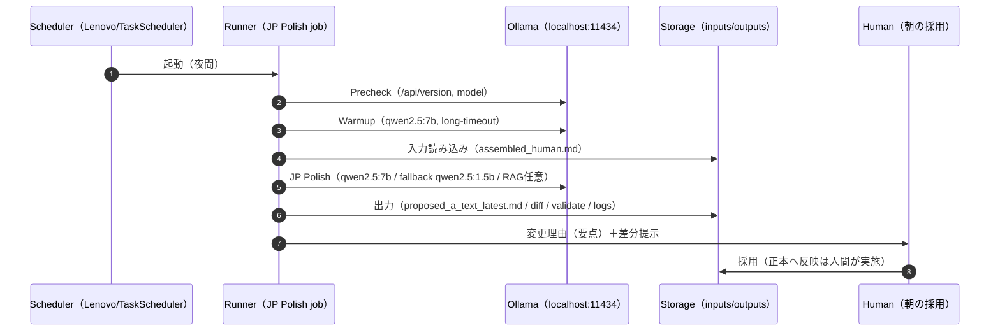

# OPS_SCRIPT_PRE_ANNOTATION_WORKFLOW — 企画→アノテ前（Aテキスト確定まで）の工程定義（SSOT）

目的:
- Codexが作った「叩き台（下書き）」を、**読み上げ台本（Aテキスト）として自然な日本語**に整える工程を、毎回必ず通る“固定フェーズ”として定義する。
- 「どれが正本で、どこに何を出すか（I/O）」を固定し、夜間バッチ（Lenovo常駐）で回しても迷子にならないようにする。
- **正本を勝手に上書きしない**（提案→差分→人間が採用）を原則にする。

関連（正本）:
- SoTの場所: `ssot/ops/OPS_SCRIPT_SOURCE_MAP.md`
- 台本パイプラインSSOT: `ssot/ops/OPS_SCRIPT_PIPELINE_SSOT.md`
- 台本運用手順: `ssot/ops/OPS_SCRIPT_GUIDE.md`
- Aテキスト品質下限（SSOT）: `ssot/ops/OPS_A_TEXT_GLOBAL_RULES.md`
- アノテ（A→B）確定: `ssot/ops/OPS_TTS_ANNOTATION_FLOW.md`

---

## 0) 用語（この文書の定義）

- **Aテキスト**: 読み上げ用の本文（内容/表示の正本）。TTS都合で書き換えない。
- **日本語補正（JP Polish）**: Aテキストを「耳で自然」にするフェーズ（言い回し/接続/冗長/係り受け）を整える。
- **Codex補正**: 叩き台の“構造/整合”を寄せるフェーズ（抜け・重複・メタ混入・矛盾を潰す）。
- **アノテ**: Aを変えずにB（TTS入力）を確定するフェーズ（読み/辞書/正規化）。

---

## 1) 工程（企画→アノテ前）— 固定ステップ定義

下の順序を**毎回固定**する（例外はSSOTへ記録）。

### Step 1. 企画（Planning）

- 目的: 「何を作るか」を確定する
- SoT:
  - `workspaces/planning/channels/CHxx.csv`
- 出力:
  - 企画行（タイトル/意図/要点/ステータス）
  - （任意）Patch運用: `workspaces/planning/patches/*.yaml` + 差分ログ

### Step 2. プロット（設計図）

- 目的: 話の骨格（導入→展開→結論/章立て）を決める
- 対応ステージ（概念対応）:
  - `script_master_plan`（設計図）
- 出力（例）:
  - `workspaces/scripts/{CH}/{NNN}/content/analysis/master_plan.json`（実装/運用により場所は変わりうるが、設計図が残ることを必須にする）

### Step 3. リサーチ（Research）

- 目的: 断定の根拠を固め、作り話/混入を減らす（特に数字/固有名詞）
- 対応ステージ:
  - `topic_research`
- 出力:
  - `workspaces/scripts/{CH}/{NNN}/content/analysis/research/*`（束ね）

### Step 4. アウトライン（Outline）

- 目的: 文章化前に論旨のズレを安く止める
- 対応ステージ:
  - `script_outline`
- 出力:
  - `workspaces/scripts/{CH}/{NNN}/content/analysis/outline*`（運用に合わせる）

### Step 5. 執筆（Writer）→ 下書き（Draft）

- 目的: 叩き台の本文を出す（この時点では不自然さが残ってよい）
- 対応ステージ:
  - `script_draft`
- SoT（本文の正）:
  - `workspaces/scripts/{CH}/{NNN}/content/assembled_human.md`（存在すれば正本）
  - `workspaces/scripts/{CH}/{NNN}/content/assembled.md`（ミラー/互換）

### Step 6. Codex補正（構造・整合）

- 目的: 叩き台の事故（重複/抜け/メタ混入/矛盾/禁則）を減らす
- 対応ステージ（概念対応）:
  - `script_review`（レビュー/整合の寄せ）
- 出力:
  - **正本は上書きしない**。提案を別ファイルに出し、差分でレビュー可能にする

### Step 7. 日本語補正（JP Polish / 読み上げ自然化）【必須フェーズ】

目的:
- 読み上げ台本として「耳で自然」になるように、言い回し/接続/係り受け/冗長を整える。

**ハード制約（絶対）**
- `---`（ポーズ行）は **増やさない / 減らさない / 位置を変えない**（台本設計そのもののため）
- 内容の捏造/数字の追加/固有名詞の創作はしない
- URL/箇条書き/Markdown装飾は混入させない（AテキストSSOT）

推奨実行環境:
- 夜間バッチは **Lenovo（常駐）** を前提
- ただし入力がMacローカルにある場合は「Macで実行して推論だけLenovoへ」が最短（`--ollama-url`）

I/O（固定案）:
- 入力: AテキストSoT（`assembled_human.md` 優先）
- 出力: **提案のみ**（正本は触らない）
  - `workspaces/scripts/{CH}/{NNN}/content/analysis/jp_polish/` 配下に、
    - `proposed_a_text_{run_id}.md` / `proposed_a_text_latest.md`（提案本文）
    - `proposed_a_text_{run_id}.diff` / `proposed_a_text_latest.diff`（unified diff）
    - `change_summary_{run_id}.md` / `change_summary_latest.md`（変更理由の要点）
    - `validate_{run_id}.md` / `validate_latest.md`（SSOT簡易検証: `---`増減/混入）
    - `run_meta_{run_id}.json` / `run_meta_latest.json`（実行メタ）
    - `log_{run_id}.jsonl` / `log_latest.jsonl`（証跡）

#### モデル運用ルール（厳格 / 品質最優先）

背景:
- Ollamaで「全文を校正して全文出力」をやると、**要約で短くなる**／**否定の反転など文意が変わる**リスクがある（自動一括適用は危険）。

原則（強制）:
- **JP Polishは提案のみ**（正本を自動上書きしない）。
- `validate.md` がNG（例: `---` 位置不一致 / 数字の改変 / 文字数が極端に減る）なら、その提案は「失敗」として扱い、採用しない。

モデル推奨:
- 品質優先: `qwen2.5:7b`（温度 `0.0` 推奨）
- 速度優先/フォールバック: `qwen2.5:1.5b`（ただし“意味ズレ検知”の手動チェックを厚くする）

Lenovo（夜間）での実務ポイント:
- `qwen2.5:7b` は **コールドスタートが遅い**ことがあるため、ジョブ冒頭で warmup を必須にする（例: 「OKとだけ返して」を長めtimeoutで1回）。
- warmup後も「モデル/timeout/所要時間」を `run_meta.json` と夜間一覧 `.jsonl` に必ず記録する（翌朝の判断材料）。

### Step 8. 手動レビュー（通し読み）【必須ゲート】

- 目的: “聞き手としての違和感” を最後に潰す（機械を代替にしない）
- 記録（必須）:
  - `workspaces/scripts/{CH}/{NNN}/content/analysis/manual_review.md`

### Step 9. 検証（Validate）→ アノテ前の合格

- 目的: 禁則/混入/未完/意味ズレを止め、下流へ渡せる状態にする
- 対応ステージ:
  - `script_validation`
- 合格条件（最小）:
  - AテキストがSSOT（`OPS_A_TEXT_GLOBAL_RULES`）に適合
  - `script_validation` が `completed`

この時点で「アノテ（A→B）」に進む。

---

## 2) 夜間バッチ（Lenovo常駐）— 運用の前提

方針:
- 夜間は **提案生成（JP Polish）まで**を自動化し、朝に人が採用判断する。
- 11434の外部公開は不要（Lenovoローカルで叩く）。Tailscale越し運用は補助。

決定（運用確定）:
1) Lenovoが読む入力（SoT）:
   - **共有SoT（推奨/既定）**: `ytm_workspaces/scripts/{CH}/{NNN}/content/assembled_human.md`（無い場合は `assembled.md`）
     - Mac（マウント）: `/Users/dd/mounts/lenovo_share_real/ytm_workspaces/scripts/...`
     - Lenovo（ローカル）: `C:\doraemon_share\ytm_workspaces\scripts\...`
   - ※Macローカルで編集/生成した `workspaces/scripts/**` は、夜間開始前に vault へ同期する（`scripts/ops/workspaces_mirror.py`）。
2) 出力（朝すぐ見られる場所）:
   - **各エピソード配下に同居**（迷子防止）: `.../content/analysis/jp_polish/`
   - さらに「夜間の一覧」も出す: `ytm_workspaces/scripts/_night_jobs/jp_polish/{YYYY-MM-DD}.jsonl`
     - 1行=1エピソード（script_id / 入力ハッシュ / 出力ディレクトリ / 成否 / モデル / 所要時間）
3) Runner（夜間実行スクリプト）:
   - `scripts/ops/jp_polish_night_batch.py`
   - 既定動作: `workspaces/scripts/**` を走査し、直近 `--since-hours` 以内に更新された `assembled_human.md`（無ければ `assembled.md`）で、提案が未生成/古いものだけを処理する。
   - 実行例（LenovoローカルでOllama）:
     - dry-run: `python scripts/ops/jp_polish_night_batch.py --since-hours 24 --dry-run`
     - run: `python scripts/ops/jp_polish_night_batch.py --since-hours 24 --warmup`
   - 補足:
     - 共有SoTで回す場合は `YTM_WORKSPACE_ROOT` を `ytm_workspaces` に向ける（Task Scheduler側で環境変数 or .env で指定）。

---

## 3) シーケンス（夜間バッチ / JP Polish）

※「正本を勝手に上書きしない（提案→差分→採用）」を必ず守る。

補足:
- 夜間の集約一覧 `.jsonl` は、翌朝の「採用判断/失敗切り分け」のための一次ログ（必須）。
